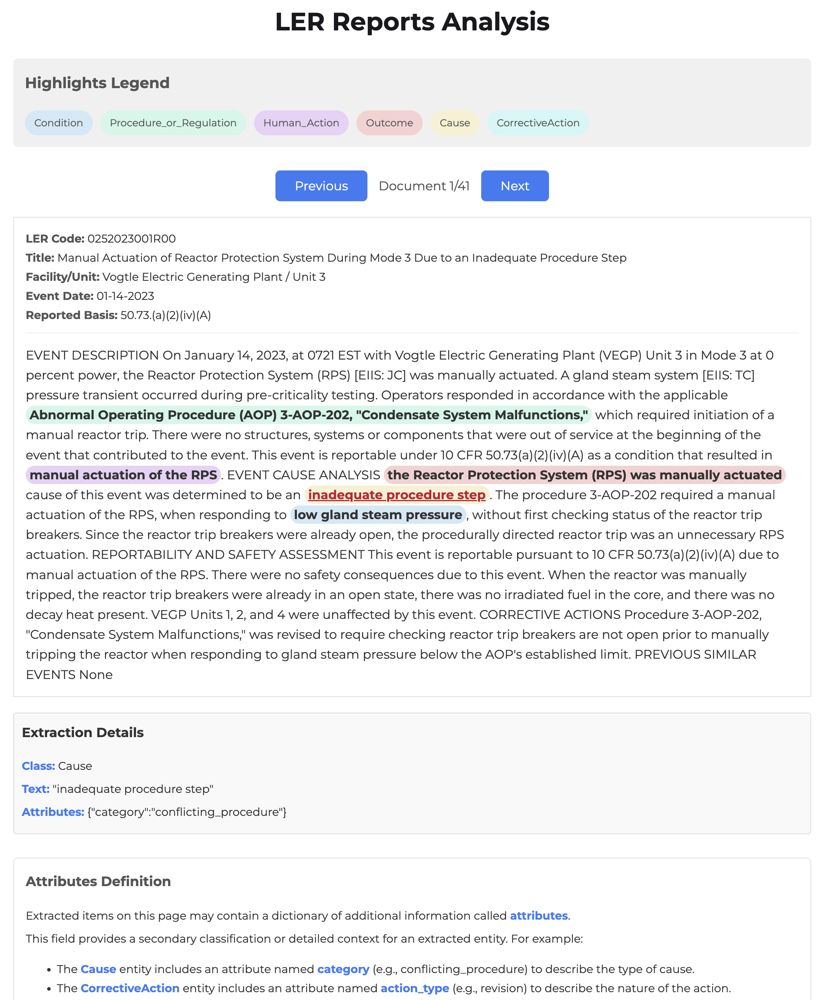

# VisLER: LER Analysis Tool

The `langextract` folder contains a standalone tool for analyzing **Licensee Event Reports (LERs)** from a given CSV dataset.

**Live Demo:** [https://vis-ler.vercel.app/](https://vis-ler.vercel.app/)

## Installation

### 1. Create and Activate Conda Environment
```bash
conda create -n visler python=3.10
conda activate visler
```

### 2. Install Dependencies

You can install dependencies individually:
```bash
pip install langextract
pip install tabulate
pip install python-dotenv
```

Or install all at once using `requirements.txt`:
```bash
pip install -r requirements.txt
```

### 3. Store API Key Securely
1. Create a `.env` file in the project root:
   ```env
   LANGEXTRACT_API_KEY=YOUR_API_KEY
   ```

2. In your Python scripts (e.g., `run.py`), load the key:
   ```python
   from dotenv import load_dotenv
   import os

   load_dotenv()
   api_key = os.getenv("LANGEXTRACT_API_KEY")
   ```

3. Add `.env` to `.gitignore` to avoid committing it to Git:
   ```
   .env
   ```

## Features

- **NER-based Data Extraction**  
  `run.py` processes LER data and extracts structured entities such as:
  - `Cause`
  - `Procedure_or_Regulation`
  - `Condition`

- **HTML Visualization**  
  `vis.py` generates a static, interactive HTML report (`custom_visualization.html`) that visualizes extracted entities.

- **Interactive Report**  
  - Custom highlighting of entities
  - Legend explaining entity types
  - Clickable entities that display details in a side panel

## Example Output



## Acknowledgements

This project uses [LangExtract](https://github.com/google/langextract) by Google,  
licensed under the Apache License 2.0.
